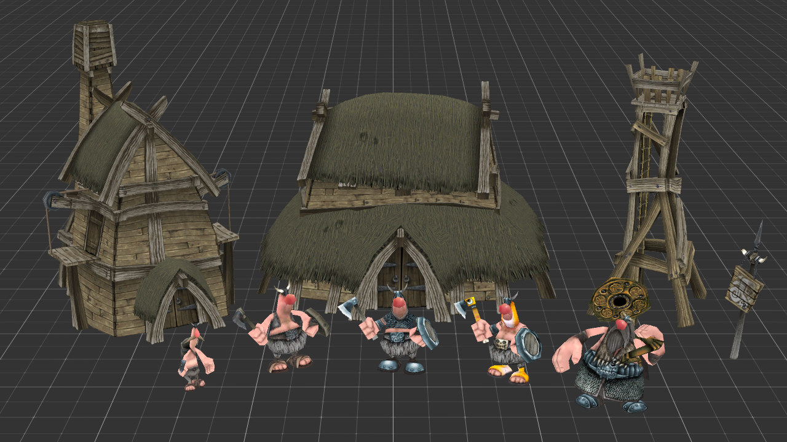
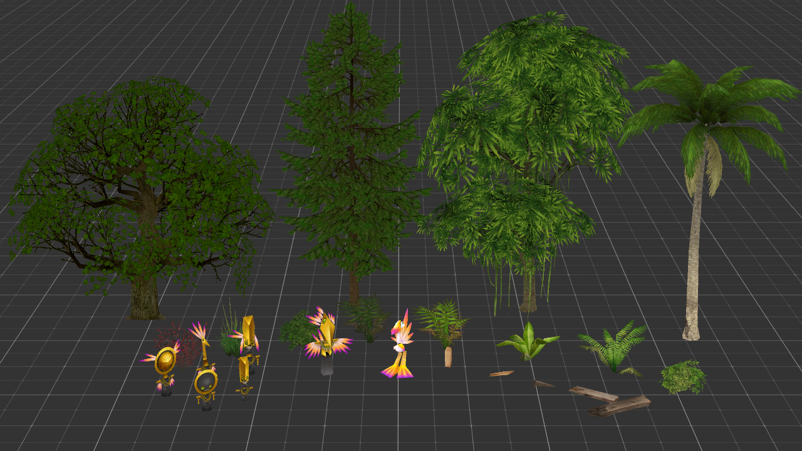
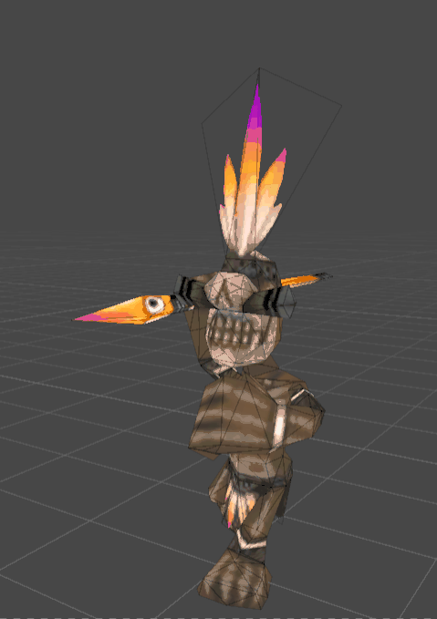

# Tribal Trouble Assets

This repository provides a **script to convert Tribal Trouble assets from their original XML format into glTF**, making them easier to use in modern game engines.  
Converted assets are also provided in the [Releases](#) section.  

## Assets

The following assets are included:

#### Vikings

#### Natives

#### Misc

- Most assets include **low-poly versions**.  
- Buildings also include **half-built variants**.

## Animations
Character models are **skinned** and include a **skeleton with multiple animations**.  

## Running the script

1. Download the repository to your local machine.  
2. run `py main.py`
This will generate an output/ folder containing all converted assets.

### Notes
- You might need to adjust the path inside `main.py` to point to your local `tribaltrouble/tt` directory.
Original files can be downloaded from https://github.com/sunenielsen/tribaltrouble
- Some `.xml` skeleton files contain invalid skeletons. To correct them:
	- `peon_skeleton.xml`: replace line 59 `peon bip L Finger0` with `peon bip L Hand`
	- `chicken_skeleton.xml`: replace lines 38-39 `chickenBip R/L Clavicle` with `chickenBip Spine`
- The `geometry.xml` file is used to build and combine the assets.
	- The one under `tt/geometry` works but splits many assets into separate files.
	- For an up-to-date version, use the one included in this repository.